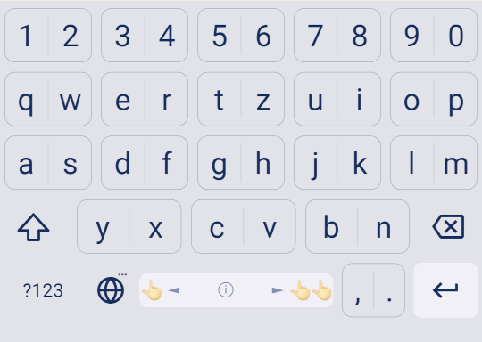
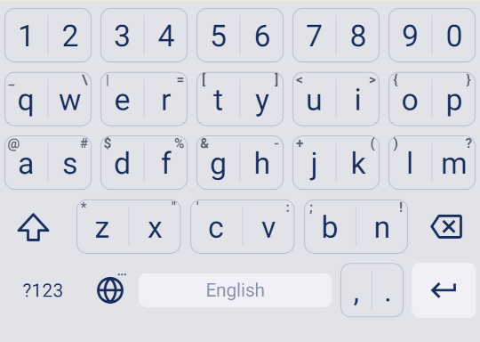
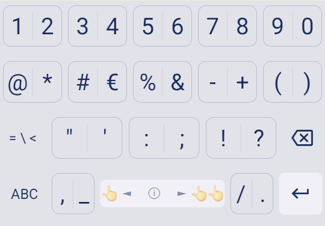
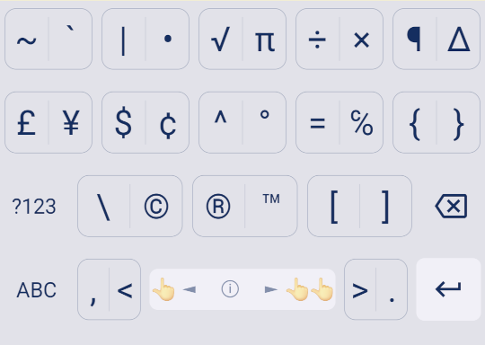

# Widekey Keyboard

A keyboard designed for precision and control. Each key holds two characters — tap once for the left, tap twice for the right — giving you effectively double-wide tap targets and far fewer misses. No autocorrect, no predictions, no second-guessing.

## Features

- **Double-tap keys** — each key contains two characters, single-tap for the primary, double-tap for the secondary
- Small size (<1MB)
- Adjustable keyboard height for more screen space
- Number row
- Swipe space to move pointer
- Delete swipe
- Custom theme colors
- Minimal permissions (only Vibrate)
- Ads-free

## Features it doesn't have and probably will never have

- Autocorrect / spell checker
- Swipe typing
- Emojis / GIFs
- Word predictions

## Credits

Licensed under Apache License Version 2.

Widekey Keyboard is a fork of [Simple Keyboard](https://github.com/rkkr/simple-keyboard) by rkkr, which is itself based on the [AOSP LatinIME keyboard](https://android.googlesource.com/platform/packages/inputmethods/LatinIME/). We are grateful to both projects for their work.

## Screenshots

   
